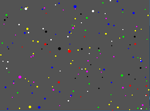

## What is this ?
Balls ! Just a playground for testing stuff and performances.
Each ball randomly changes its color. On collision if they have the same color they merge, otherwise bounce.

I am using [SFML](https://github.com/SFML/SFML) for rendering and [EnTT](https://github.com/skypjack/entt) for entities management and some few handmade classes that act like an "engine".

## Todo List

* Implement Quadtree for collisions check
* Endorse graphic ( switching to textures ? )
* ~~Implement a more-likely-real collision response~~
* ~~Interactive way to spawn balls~~
* Add any cool effect I can think about

## How to build

Actually is quite simple I'll add some istruction later

